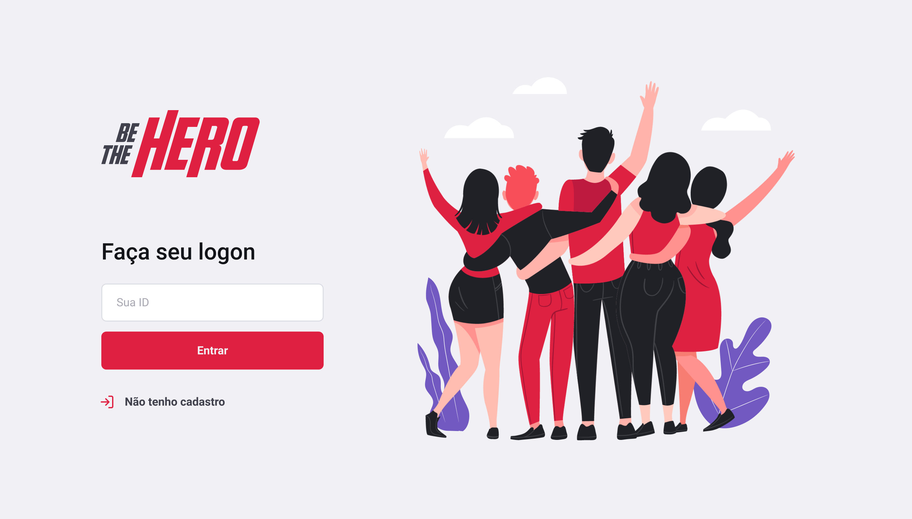

<h4 align="center">

 Seja um herói para alguém
</h4>

## OmniStack
Project developed in the OmniStack week - Be The Hero.

## 💻 Project

Be The Hero is a project that aims to connect people who are willing to help ONGs.

## :rocket: Technologies

This project was developed with the following technologies:

- [Node.js](https://nodejs.org/en/) 
- [React](https://reactjs.org)
- [React Native](https://facebook.github.io/react-native/)
- [Expo](https://expo.io/)

## 🔖 Layout

Access the link on [Figma](https://www.figma.com/file/2C2yvw7jsCOGmaNUDftX9n/Be-The-Hero---OmniStack-11?node-id=0%3A1).
